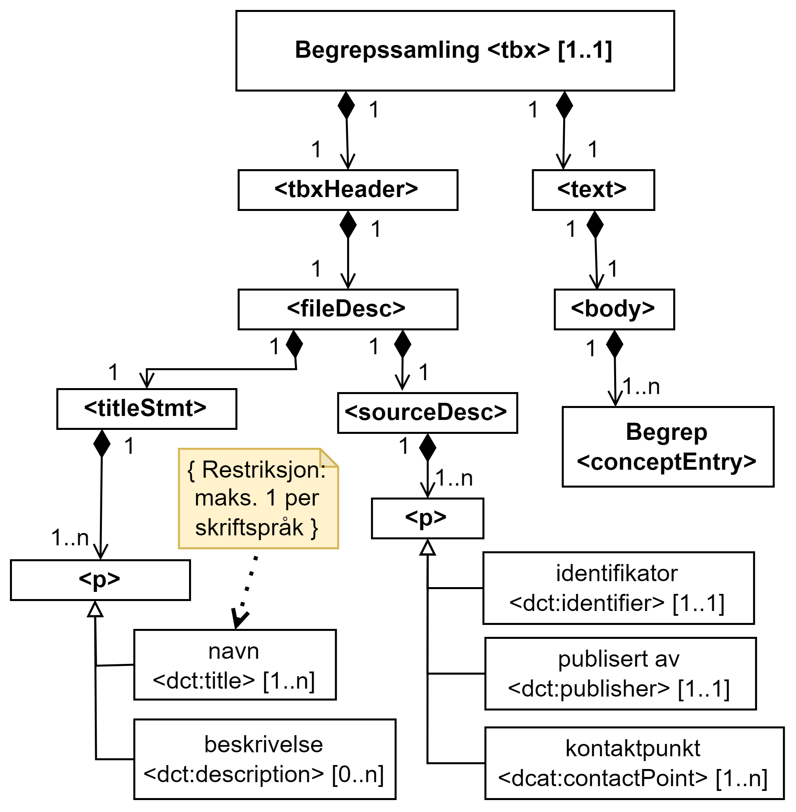

== Krav til TBX-representasjon av en begrepssamling [[Krav-begrepssamling]]

=== Begrepssamling <tbx> (1..1)

[Figur-tbx]
.Begrepssamling (<tbx>) (basert på Fig. 2 i NS-ISO 30042:2019)
[link=images/TBX-AP-NO_Begrepssamling.png]

`<tbx>` er roten til en TBX-fil. Den brukes til å representere en begrepssamling.

Følgende skal tas med sammen med start-taggen av `<tbx>`:

* `xmlns="urn:iso:std:iso:30042:ed-2"` som refererer til ISO 30042:2019
* `style="dct"` eller `style="dca"` som forteller hvilken stil som er brukt i filen
* `type="TBX-AP-NO-v2"`, som refererer denne versjonen av TBX-AP-NO
* `xml:lang="nb"` for bokmål, `"nn"` for nynorsk, `"en"` for engelsk osv., som forteller hvilket hovedspråk som er brukt i filen, som kan overstyres av språkkoden oppgitt i den enkelte `<langSec>`
* når `style="dct"` er brukt, skal navnerom oppgis for alle prefiksene som er brukt i filen, f.eks. `xmlns:basic=http://www.tbxinfo.net/ns/basic`, se <<Navnerom>> for alle prefiksene som er brukt i denne standarden, med tilhørende navnerom

Denne standarden bruker bare `<fileDesc>`-delen av `<tbxHeader>`, og bare `<titleStmt>` og `<sourceDesc>` i `<fileDesc>`. `<titleStmt>` og `<fileDesc>` vil bli beskrevet i etterfølgende avsnitt.

`<tbx>` _is the root of a TBX-file. It is used to represent a concept collection._

_The following shall be used with the start tag of `<tbx>`:_

* `xmlns="urn:iso:std:iso:30042:ed-2"` _which refers to ISO 30042:2019_
* `style="dct"` _or_ `style="dca"` _which specifies the style used in the file_
* `type="TBX-AP-NO-v2"` _which refers to this version of TBX-AP-NO_
* `xml:lang="nb"` _for Norwegian bokmål, `"nn"` for Norwegian nynorsk, `"en"` for English etc., which specifies the main language that is used in the file, which may be overridden by the language code given in the_ `<langSec>`
* _when `style="dct"` is used, name spaces for all prefixes that are used in the file shall be given, e.g., `xmlns:basic=http://www.tbxinfo.net/ns/basic`, see <<Navnerom>> for all prefixes that are used in this standard with corresponding name spaces_

_This standard only uses the `<fileDesc>`-part of `<tbxHeader>`, and only `<titleStmt>` and `<sourceDesc>` in `<fileDesc>`. `<titleStmt>` and `<sourceDesc>` will be described in the following sections._

=== <titleStmt> (1..1) [[titleStmt]]

Navn og beskrivelse til begrepssamlingen oppgis i `<titleStmt>`.

_The name and description of the concept collection is specified in `<titleStmt>`._

==== Begrepssamling – navn <dct:title> (1..n) [[Begrepssamling-navn]]

[cols="30s,70d"]
|===
| Navn / _Name_ |navn / _title_
| Datakategori / _Data category_ |dct:title
|*PID*|http://purl.org/dc/terms/title[http://purl.org/dc/terms/title]
| TBX-nivå / _TBX level_ |fileStmt
| TBX-klassifisering / _TBX Classification_ |p
| Verdiområde / _Range_ |String
| Anvendelse / _Usage note_ |
Egenskapen brukes til å oppgi navnet til begrepssamlingen. Egenskapen bør gjentas når navnet er i flere språk.

_This property is used to specify the name of the concept collection. The property should be repeated when the name is in several languages._
| Multiplisitet / _Multiplicity_ |1..n
| Kravnivå / _Requirement level_ |Obligatorisk /  _Mandatory_ 
|===

Eksempel i TBX-AP-NO (DCT style), se under <<TBX-eksempel-begrepssamling>>.

==== Begrepssamling – beskrivelse <dct:description> (0..n) [[Begrepssamling-beskrivelse]]

[cols="30s,70d"]
|===
| Navn / _Name_ |beskrivelse / _description_
| Datakategori / _Data category_ |dct:description
|*PID*|http://purl.org/dc/terms/description[http://purl.org/dc/terms/description]
| TBX-nivå / _TBX level_ |fileStmt
| TBX-klassifisering / _TBX Classification_ |p
| Verdiområde / _Range_ |String
| Anvendelse / _Usage note_ |
Egenskapen brukes til å oppgi beskrivelse av begrepssamlingen. Egenskapen bør gjentas når teksten er i flere språk.

_This property is used to specify the description of the concept collection. The property should be repeated when the text is in several languages._
| Multiplisitet / _Multiplicity_ |0..n
| Kravnivå / _Requirement level_ |Anbefalt / Recommended
|===

Eksempel i TBX-AP-NO (DCT style), se under <<TBX-eksempel-begrepssamling>>.

=== <sourceDesc> (1..1) [[sourceDesc]]

Begrepssamlingens identifikator, virksomheten som publiserte begrepssamlingen og kontaktpunkt(er) til virksomheten oppgis i `<sourceDesc>`.

_The concept collection's identifier, publisher and contact point to the publisher are specified in `<sourceDesc>`._

==== Begrepssamling – identifikator <dct:identifier> (1..1) [[Begrepssamling-identifikator]]

[cols="30s,70d"]
|===
| Navn / _Name_ |identifikator / _identifier_
| Datakategori / _Data category_ |dct:identifier
|*PID*|http://purl.org/dc/terms/identifier[http://purl.org/dc/terms/identifier]
| TBX-nivå / _TBX level_ |sourceDesc
| TBX-klassifisering / _TBX Classification_ |p
| Verdiområde / _Range_ |String
| Anvendelse / _Usage note_ |
Egenskapen brukes til å oppgi identifikatoren til begrepssamlingen.

_This property is used to specify the identifier to the concept collection._
| Multiplisitet / _Multiplicity_ |1..1
| Kravnivå / _Requirement level_ |Obligatorisk /  _Mandatory_ 
|===

Eksempel i TBX-AP-NO (DCT style), se under <<TBX-eksempel-begrepssamling>>.

==== Begrepssamling – publisert av <dct:publisher> (1..1) [[Begrepssamling-publisert-av]]

[cols="30s,70d"]
|===
| Navn / _Name_ |publisert av / _publisher_
| Datakategori / _Data category_ |dct:publisher
|*PID*|http://purl.org/dc/terms/publisher[http://purl.org/dc/terms/publisher]
| TBX-nivå / _TBX level_ |sourceDesc
| TBX-klassifisering / _TBX Classification_ |p
| Verdiområde / _Range_ |String
| Anvendelse / _Usage note_ |
Egenskapen brukes til å referere til virksomheten som har publisert begrepssamlingen.

_This property is used to refer to the publisher of the concept collection._
| Multiplisitet / _Multiplicity_ |1..1
| Kravnivå / _Requirement level_ |Obligatorisk /  _Mandatory_ 
| Merknad / Note |
Virksomhetens identifikasjonsnummer bør brukes, for eksempel https://data.norge.no/concepts/f6639f5e-280e-4dbb-991e-3faca3bf622c[organisasjonsnummer i henhold til Enhetsregisterets organisasjonsnummer].

_The organization’s identifier should be used, e.g. in accordance to https://data.norge.no/concepts/f6639f5e-280e-4dbb-991e-3faca3bf622c[the organization number registered in the Central Coordinating Register for Legal Entities (CCR)]._
|===

Eksempel i TBX-AP-NO (DCT style), se under <<TBX-eksempel-begrepssamling>>.

==== Begrepssamling – kontaktpunkt <dcat:contactPoint> (1..n) [[Begrepssamling-kontaktpunkt]]

[cols="30s,70d"]
|===
| Navn / _Name_ |kontaktpunkt / _contact point_
| Datakategori / _Data category_ |dcat:contactPoint
|*PID*|http://purl.org/dc/terms/publisher[http://purl.org/dc/terms/publisher]
| TBX-nivå / _TBX level_ |sourceDesc
| TBX-klassifisering / _TBX Classification_ |p
| Verdiområde / _Range_ |vcard:Organization or vcard:Group
| Anvendelse / _Usage note_ |
Egenskapen brukes til å oppgi kontaktpunkt som kan nås ved spørsmål vedrørende begrepssamlingen. Det skal være maks. ett kontaktpunkt per språk, hvis det er ulike kontaktpunkter for f.eks. norske vs. internasjonale kontakter.

_This property is used to specify contact point which may be reached regarding the concept collection. There shall be maximum one contact point per language, when there are different contact points for e.g. Norwegian vs. international contacts._
| Multiplisitet / _Multiplicity_ |1..n
| Kravnivå / _Requirement level_ |Obligatorisk /  _Mandatory_ 
|===

Eksempel i TBX-AP-NO (DCT style), se under <<TBX-eksempel-begrepssamling>>.
