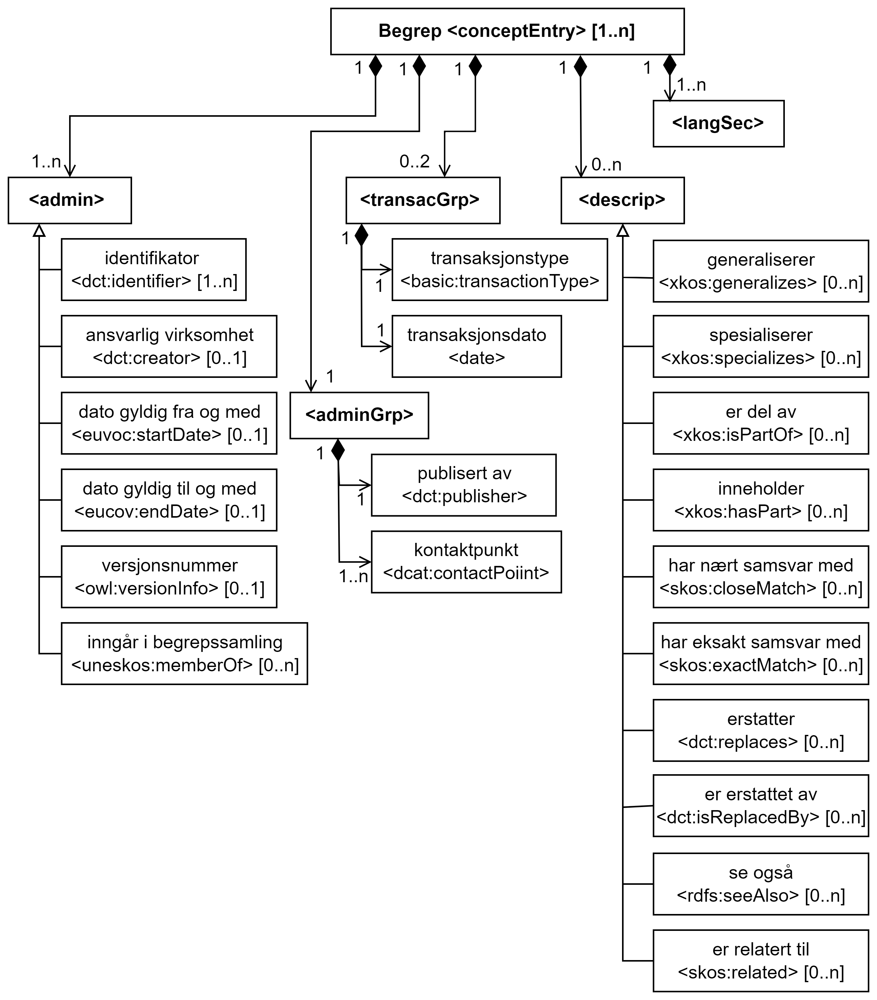

=== <conceptEntry> (1..n) [[conceptEntry]]

[Figur-conceptEntry]
.Begrep (<conceptEntry>) (basert på Fig. 3 i NS-ISO 30042:2019)
[link=images/TBX-AP-NO_conceptEntry.png]

`<conceptEntry>` er obligatorisk og skal brukes til å representere ett gitt begrep. De ulike delene av `<conceptEntry>` vil bli spesifisert i de etterfølgende avsnittene.

Restriksjon: I henhold til TBX skal `<conceptEntry>`-start-taggen inneholde en `id` til begrepet.

`<conceptEntry>` _is mandatory and shall be used to represent one given concept. The various parts of `<conceptEntry>` will be specified in the following sections._

_Restriction: According to TBX, the `<conceptEntry>` start tag shall contain an `id` to the concept entry._

Eksempel i TBX-AP-NO (DCT style):
[source,xml]
-----
<conceptEntry id="cid-1">
</conceptEntry>
-----

=== <conceptEntry> | <admin> (1..n) [[conceptEntry-admin]]

`<admin>` brukes her til å oppgi ulike administrative opplysninger om begrepet.

`<admin>` _is used here to specify various administrative information about the concept._

==== Begrep – identifikator <dct:identifier> (1..n) [[Begrep-identifikator]]

[cols="30s,70d"]
|===
| Navn / _Name_ |identifikator / _identifier_
| Datakategori / _Data category_ |dct:identifier
| PID |http://purl.org/dc/terms/identifier[http://purl.org/dc/terms/identifier]
| TBX-nivå / _TBX level_ |conceptEntry
| TBX-klassifisering / _TBX Classification_ |admin
| Verdiområde / _Range_ |xref
| Anvendelse / _Usage note_ | Egenskapen brukes til å oppgi identifikator til begrepet, som en URI.

_This property is used to specify an identifier to the concept, as a URI._
| Multiplisitet / _Multiplicity_ / _Multiplicity_ |1..n
| Kravnivå / _Requirement level_ |Obligatorisk / _Mandatory_
|===

Eksempel i TBX-AP-NO (DCT style), NAVs begrep 975 («mødrekvote»):
[source,xml]
-----
<conceptEntry id="BEGREP-975">
   <dct:identifier>https://data.norge.no/concepts/6bd8baed-c9d7-4dbc-b850-78ceeebdc1d5</dct:identifier>
</conceptEntry>
-----

==== Begrep – ansvarlig virksomhet <dct:creator> (0..1) [[Begrep-ansvarlig-virksomhet]]

[cols="30s,70d"]
|===
| Navn / _Name_ | ansvarlig virksomhet / _responsible organization_
| Datakategori / _Data category_ | dct:creator
| PID | http://purl.org/dc/terms/creator
| TBX-nivå / _TBX level_ |conceptEntry
| TBX-klassifisering / _TBX Classification_ |admin
| Verdiområde / _Range_ |xref
| Anvendelse / _Usage note_ |Egenskapen brukes til å referere til virksomheten som er ansvarlig for beskrivelsen av begrepet, og som ikke er den samme som <<Begrep-publisert-av>>.

_This property is used to refer to the organization responsible for the description of the concept, which is not the same as <<Begrep-publisert-av>>._
| Multiplisitet / _Multiplicity_ | 0..n
| Kravnivå / _Requirement level_| Anbefalt / _Recommended_
|===

==== Begrep – dato gyldig fra og med <euvoc:startDate> (0..1) [[Begrep-dato-gyldi-fra-og-med]]

[cols="30s,70d"]
|===
| Navn / _Name_ |dato gyldig fra og med / _date valid from, inclusive_
| Datakategori / _Data category_ |euvoc:startDate
| PID | https://showvoc.op.europa.eu/#/datasets/OP_EuVoc_Ontology/data?resId=http:%2F%2Fpublications.europa.eu%2Fontology%2Feuvoc%23startDate[http://publications.europa.eu/startDate]
| TBX-nivå / _TBX level_ |conceptEntry
| TBX-klassifisering / _TBX Classification_ |admin
| Verdiområde / _Range_ |String
| Anvendelse / _Usage note_ | Egenskapen brukes til å oppgi hvilken dato begrepet er gyldig fra og med.

 _This property is used to specify the date (inclusive) from which the concept is valid._
| Multiplisitet / _Multiplicity_ |0..1
| Kravnivå / _Requirement level_|Anbefalt / _Recommended_
|===

Eksempel i TBX-AP-NO (DCT style), for et fiktivt eksempelbegrep:
[source,xml]
-----
<conceptEntry id="cid-1">
   <euvoc:startDate>2020-07-31</euvoc:startDate>
</conceptEntry>
-----

==== Begrep – dato gyldig til og med <euvoc:endDate> (0..1) [[Begrep-dato-gyldig-til-og-med]]

[cols="30s,70d"]
|===
| Navn / _Name_ |dato gyldig til og med / _date valid through, inclusive_
| Datakategori / _Data category_ |euvoc:endDate
| PID | https://showvoc.op.europa.eu/#/datasets/OP_EuVoc_Ontology/data?resId=http:%2F%2Fpublications.europa.eu%2Fontology%2Feuvoc%23endDate[http://publications.europa.eu/endDate]
| TBX-nivå / _TBX level_ |conceptEntry
| TBX-klassifisering / _TBX Classification_ |admin
| Verdiområde / _Range_ |String
| Anvendelse / _Usage note_ | Egenskapen brukes til å oppgi hvilken dato begrepet er gyldig til og med.

_This property is used to specify the date (inclusively) through which the concept is valid._
| Multiplisitet / _Multiplicity_ |0..1
| Kravnivå / _Requirement level_|Anbefalt / _Recommended_
|===

Eksempel i TBX-AP-NO (DCT style), for et fiktivt eksempelbegrep:
[source,xml]
-----
<conceptEntry id="cid-1">
   <euvoc:endDate>2020-12-31</euvoc:endDate>
</conceptEntry>
-----

==== Begrep – versjonsnummer <owl:versionInfo> (0..1) [[Begrep-versjonsnummer]]

[cols="30s,70d"]
|===
| Navn / _Name_ |versjonsnummer / _version number_
| Datakategori / _Data category_ |owl:versionInfo
| PID |https://www.w3.org/TR/owl-ref/#versionInfo-def[http://www.w3.org/2002/07/owl#versionInfo]
| TBX-nivå / _TBX level_ |conceptEntry
| TBX-klassifisering / _TBX Classification_ |admin
| Verdiområde / _Range_ |String
| Anvendelse / _Usage note_ | Egenskapen brukes til å oppgi versjonsnummeret til begrepet.

_This property is used to specify the version number of the concept._
| Multiplisitet / _Multiplicity_ |0..1
| Kravnivå / _Requirement level_|Valgfri / _Optional_
|===

Eksempel i TBX-AP-NO (DCT style), for et fiktivt eksempelbegrep:
[source,xml]
-----
<conceptEntry id="cid-1">
   <owl:versionInfo>1.0.1</owl:versionsInfo>
</conceptEntry>
-----

==== Begrep – inngår i begrepssamling <uneskos:memberOf> (0..n) [[Begrep-inngår-i]]

[cols="30s,70d"]
|===
| Navn / _Name_ |inngår i begrepssamling / _member of_
| Datakategori / _Data category_ |uneskos:memberOf
| PID |https://skos.um.es/TR/uneskos/#memberOf[https://skos.um.es/TR/uneskos/#memberOf]
| TBX-nivå / _TBX level_ |conceptEntry
| TBX-klassifisering / _TBX Classification_ |admin
| Verdiområde / _Range_ |ref or xref
| Anvendelse / _Usage note_ | Egenskapen brukes til å referere til begrepssamlingen begrepet inngår i.

_This property is used to refer to the concept collection that the concept is a member of._
| Multiplisitet / _Multiplicity_ |0..n
| Kravnivå / _Requirement level_|Valgfri / _Optional_
|===

Eksempel i TBX-AP-NO (DCT style), for et fiktivt eksempelbegrep:
[source,xml]
-----
<conceptEntry id="cid-1">
   <uneskos:memerOf>https://example.org/exampleConceptCollection</uneskos:memberOf>
</conceptEntry>
-----

=== <conceptEntry> | <adminGrp> (1..1) [[conceptEntry-adminGrp]]

Denne `<adminGrp>` er obligatorisk og skal brukes til å oppgi opplysninger om virksomheten som har publisert begrepet, inkl. kontaktpunkt til virksomheten.

_This `<adminGrp>` is mandatory and shall be used til specify information about the organization that has published the concept, incl. contact point to the organization._

==== Begrep – publisert av <dct:publisher> (1..1) [[Begrep-publisert-av]]

[cols="30s,70d"]
|===
| Navn / _Name_ |publisert av / _publisher_
| Datakategori / _Data category_ |dct:publisher
| PID |http://purl.org/dc/terms/publisher[http://purl.org/dc/terms/publisher]
| TBX-nivå / _TBX level_ |conceptEntry
| TBX-klassifisering / _TBX Classification_ |admin
| Verdiområde / _Range_ |String
| Anvendelse / _Usage note_ | Egenskapen brukes til å referere til utgiveren av begrepet.

_This property is used to refer to the publisher of the concept._
| Multiplisitet / _Multiplicity_ |1..1
| Kravnivå / _Requirement level_|Obligatorisk / _Mandatory_
| Merknad 1 / _Note 1_|
Denne egenskapen skal være i en `<adminGrp>` sammen med <<Begrep-kontaktpunkt>>.

_This property shall be within an `<adminGrp>` together with <<Begrep-kontaktpunkt>>._
| Merknad 2 / _Note 2_|
Virksomhetens identifikasjonsnummer bør brukes, for eksempel https://data.norge.no/concepts/f6639f5e-280e-4dbb-991e-3faca3bf622c[Enhetsregisterets organisasjonsnummer].

_The organization’s identifier should be used, e.g. https://data.norge.no/concepts/f6639f5e-280e-4dbb-991e-3faca3bf622c[the organization number registered in the Central Coordinating Register for Legal Entities (CCR)]._
|===

Eksempel i TBX-AP-NO (DCT style), for NAVs begrep 975 («mødrekvote»):
[source,xml]
-----
<conceptEntry id="BEGREP-975">
   <dct:publisher>https://organization-catalog.fellesdatakatalog.digdir.no/organizations/889640782</dct:publisher>
</conceptEntry>
-----

==== Begrep – kontaktpunkt <dcat:contactPoint> (1..n) [[Begrep-kontaktpunkt]]

[cols="30s,70d"]
|===
| Navn / _Name_ |kontaktpunkt / _contact point_
| Datakategori / _Data category_ |dcat:contactPoint
| PID | https://www.w3.org/TR/vocab-dcat-2/#Property:resource_contact_point[http://www.w3.org/ns/dcat#contactPoint]
| TBX-nivå / _TBX level_ |conceptEntry
| TBX-klassifisering / _TBX Classification_ |adminNote
| Verdiområde / _Range_ |vcard:Organization or vcard:Group
| Anvendelse / _Usage note_ |
Egenskapen brukes til å oppgi kontaktpunkt som kan nås ved f.eks. spørsmål om begrepet.

_This property is used to specify a contact point which may be reached in case of e.g. questions about the concept._
| Multiplisitet / _Multiplicity_ |1..n
| Kravnivå / _Requirement level_|Obligatorisk / _Mandatory_
| Merknad 1 / _Note 1_|
Denne egenskapen skal være i en `<adminGrp>` sammen med <<Begrep-publisert-av>>.

_This property shall be within an `<adminGrp>` together with <<Begrep-publisert-av>>._
| Merknad 2 / _Note 2_|
Når det er ulike kontaktpunkter for ulike språk (f.eks. norske vs. internasjonale kontakter), skal det oppgis maks. ett kontaktpunkt per språk.

_When there are different contact points for different languages (e.g. Norwegian vs. international contacts), there shall be maximum one contact point per language._
|===

Eksempel i TBX-AP-NO (DCT style), for NAVs begrep 975 («mødrekvote»):
[source,xml]
-----
<conceptEntry id="BEGREP-975">
   <dcat:contactPoint>
        <vcard:Organization>
            <vcard:hasEmail>mailto:begrepskatalogen@nav.no</vcard:hasEmail>
         </vcard:Organization>
   </dcat:contactPoint>
</conceptEntry>
-----

=== <conceptEntry> | <transacGrp> (0..2) [[conceptEntry-transacGrp]]

Denne `<transacGrp>` er anbefalt og brukes til å oppgi datoen da begrepet ble opprettet eller datoen da begrepet sist ble oppdatert, som begge er anbefalte egenskaper.

_This `<transacGrp>` is recommended and is used to specify the date when the concept was created or the date when the concept was last modified, which are recommended properties._

==== Begrep – transaksjonstype <basic:transactionType> (1..1) [[Begrep-transaksjonstype]]

[cols="30s,70d"]
|===
| Navn / _Name_ |transaksjonstype / _transaction type_
| Datakategori / _Data category_ |basic:transactionType
| PID | `\http://datcatinfo.termweb.eu/datcat/DC-1689`
| TBX-nivå / _TBX level_ |conceptEntry
| TBX-klassifisering / _TBX Classification_ |transac
| Verdiområde / _Range_ a|Picklist:

* basic:origination
** (PID `\http://datcatinfo.termweb.eu/datcat/DC-303`) for dato opprettet / _for date created_
* basic:modification
** (PID `\http://datcatinfo.termweb.eu/datcat/DC-305`) for dato sist oppdatert / _for date last modified_
| Anvendelse / _Usage note_ |
Egenskapen brukes til å oppgi type transaksjon.

_This property is used to specify the transaction type._
| Multiplisitet / _Multiplicity_ |1..1
| Kravnivå / _Requirement level_|Obligatorisk / _Mandatory_
| Merknad / _Note_ |
Denne egenskapen skal brukes i en `<transacGrp>` sammen med <<Begrep-transaksjonsdato>>.

_This property shall be used in a `<transacGrp>` together with <<Begrep-transaksjonsdato>>._
|===

Eksempel i TBX-AP-NO (DCT style), for et fiktivt eksempelbegrep:
[source,xml]
-----
<conceptEntry id="cid-1">
   <transacGrp>
      <basic:transactionType>basic:modification</basic:transactionType>
      <date>2022-06-30</date>
    </transacGrp>
</conceptEntry>
-----

==== Begrep – transaksjonsdato <date> (1..1) [[Begrep-transaksjonsdato]]

[cols="30s,70d"]
|===
| Navn / _Name_ |transaksjonsdato / _transaction date_
| Datakategori / _Data category_ |date
| PID | `\http://datcatinfo.termweb.eu/datcat/DC-4335`
| TBX-nivå / _TBX level_ |conceptEntry
| TBX-klassifisering / _TBX Classification_ |date
| Verdiområde / _Range_ |String
| Anvendelse / _Usage note_ |
Egenskapen brukes til å oppgi transaksjonsdatoen.

_This property is used to specify the transaction date._
| Multiplisitet / _Multiplicity_ |1..1
| Kravnivå / _Requirement level_|Obligatorisk / _Mandatory_
| Merknad / _Note_ |
Denne egenskapen skal brukes i en `<transacGrp>` sammen med <<Begrep-transaksjonstype>>.

_This property shall be used in a `<transacGrp>` together with <<Begrep-transaksjonstype>>._
|===

Eksempel i TBX-AP-NO (DCT style): Se under <<Begrep-transaksjonstype>>.

=== <conceptEntry> | <descrip> (0..n) [[conceptEnetry-descrip]]

`<descrip>` her er valgfri og kan brukes til å beskrive ulike begrepsrelasjoner som alle er valgfrie egenskaper, når det ikke er behov for å beskrive relasjonene med ytterligere egenskaper. Bruk `<descripGrp>` i `<langSec>` når det er behov for ytterligere egenskaper for relasjonen.

_The `<descrip>` here is optional and may be used to specify various concept relations which are all optional, when there is no need to describe the relations with additional information. Use `<descripGrp>` in `<langSec>` when there is a need for additional information about the concept relation._

==== Begrep – generaliserer <xkos:generalizes> (0..n) [[Begrep-generaliserer]]

[cols="30s,70d"]
|===
| Navn / _Name_ |generaliserer / _generalizes_
| Datakategori / _Data category_ |xkos:generalizes
| PID |http://rdf-vocabulary.ddialliance.org/xkos#generalizes
| TBX-nivå / _TBX level_ |conceptEntry
| TBX-klassifisering / _TBX Classification_ |descrip
| Verdiområde / _Range_ |ref or xref
| Anvendelse / _Usage note_ |
Egenskapen brukes til å referere til et annet begrep som dette begrepet generaliserer. Begrepet er https://termbasen.standard.no/term/168204529303200/nb[det generiske begrepet] og det andre begrepet er https://termbasen.standard.no/term/168204379908017/nb[det spesifikke begrepet], i en generisk relasjon mellom disse.

_This property is used to refer to another concept that this concept generalizes. This concept is the https://termbasen.standard.no/term/168204529303200/en[generic concept] and the other concept is the https://termbasen.standard.no/term/168204379908017/en[specific concept], in a generic concept relation between the two concepts._
| Multiplisitet / _Multiplicity_ |0..n
| Kravnivå / _Requirement level_|Valgfri / _Optional_
| Merknad 1 / _Note 1_|
Egenskapen/relasjonen kan også leses som «har spesifikt begrep».

_This property/relation may also be read as “has specific concept”._
| Merknad 2 / _Note 2_|
Egenskapen/relasjonen er den motsatte av <<Begrep-spesialiserer>>.

_This property/relation is the inverse of <<Begrep-spesialiserer>>._
| Merknad 3 / _Note 3_|
Bruk <<Begrep-har-generisk-begrepsrelasjon>> når det er behov for å beskrive https://termbasen.standard.no/term/168204529703821/nb[inndelingskriterium].

_Use <<Begrep-har-generisk-begrepsrelasjon>> when there is a need to describe the https://termbasen.standard.no/term/168204529703821/en[criterion of subdivision]._
|===

Eksempel i TBX-AP-NO (DCT style), for NAVs begrep 625 («ytelsesperiode») som generaliserer begrep 974 («foreldrepengeperiode»):
[source,xml]
-----
<conceptEntry id="BEGREP-625">
   <xkos:generalizes>https://data.norge.no/concepts/4729eca4-f145-4518-8309-3e02a84dfc55</xkos:generalizes>
</conceptEntry>
-----

==== Begrep – spesialiserer <xkos:specializes> (0..n) [[Begrep-spesialiserer]]

[cols="30s,70d"]
|===
| Navn / _Name_ |spesialiserer / _specializes_
| Datakategori / _Data category_ |xkos:specializes
| PID |http://rdf-vocabulary.ddialliance.org/xkos#specializes
| TBX-nivå / _TBX level_ |conceptEntry
| TBX-klassifisering / _TBX Classification_ |descrip
| Verdiområde / _Range_ |ref or xref
| Anvendelse / _Usage note_ |
Egenskapen brukes til å referere til et annet begrep som dette begrepet spesialiserer. Begrepet er https://termbasen.standard.no/term/168204379908017/nb[det spesifikke begrepet] og det andre begrepet er https://termbasen.standard.no/term/168204529303200/nb[det generiske begrepet], i en generisk relasjon mellom disse.

_This property is used to refer to another concept that this concept specializes. This concept is the https://termbasen.standard.no/term/168204379908017/en[specific concept] and the other concept is the https://termbasen.standard.no/term/168204529303200/en[generic concept], in a generic concept relation between the two concepts._
| Multiplisitet / _Multiplicity_ |0..n
| Kravnivå / _Requirement level_|Valgfri / _Optional_
| Merknad 1 / _Note 1_|
Egenskapen/relasjonen kan også leses som «har generisk begrep».

_This property/relation may also be read as “has generic concept”._
| Merknad 2 / _Note 2_|
Egenskapen/relasjonen er den motsatte av <<Begrep-generaliserer>>.

_This property/relation is the inverse of <<Begrep-generaliserer>>._
| Merknad 3 / _Note 3_|
Bruk <<Begrep-har-generisk-begrepsrelasjon>> når det er behov for å beskrive https://termbasen.standard.no/term/168204529703821/nb[inndelingskriterium].

_Use <<Begrep-har-generisk-begrepsrelasjon>> when there is a need to describe the https://termbasen.standard.no/term/168204529703821/en[criterion of subdivision]._
|===

Eksempel i TBX-AP-NO (DCT style), for NAVs begrep 974 («foreldrepengeperiode») som spesifiserer begrep 625 («ytelsesperiode»):
[source,xml]
-----
<conceptEntry id="BEGREP-625">
   <xkos:specializes>https://data.norge.no/concepts/680b83b6-46f5-30f2-96f7-e36c4e5cf3d1</xkos:specializes>
</conceptEntry>
-----

==== Begrep – er del av <xkos:isPartOf> (0..n) [[Begrep-er-del-av]]

[cols="30s,70d"]
|===
| Navn / _Name_ |er del av / _is part of_
| Datakategori / _Data category_ |xkos:isPartOf
| PID |http://rdf-vocabulary.ddialliance.org/xkos#isPartOf
| TBX-nivå / _TBX level_ |conceptEntry
| TBX-klassifisering / _TBX Classification_ |descrip
| Verdiområde / _Range_ |ref or xref
| Anvendelse / _Usage note_ |
Egenskapen brukes til å knytte begrepet til et annet begrep som dette begrepet er del av. Begrepet er et https://termbasen.standard.no/term/168204378306478/nb[delbegrep], og det andre begrepet er https://termbasen.standard.no/term/168204367709913/nb[helhetsbegrepet], i en partitiv relasjon mellom disse.

_This property is used to refer to the concept that this concept is a part of. This concept is a https://termbasen.standard.no/term/168204378306478/en[partitive concept] and the other concept is the https://termbasen.standard.no/term/168204367709913/en[comprehensive concept], in a partitive concept relation between the two concepts._
| Multiplisitet / _Multiplicity_ |0..n
| Kravnivå / _Requirement level_|Valgfri / _Optional_
| Merknad 1 / _Note 1_|
Egenskapen/relasjonen kan også leses som «har helhetsbegrep».

_This property/relation may also be read as “has comprehensive concept”._
| Merknad 2 / _Note 2_|
 Denne egenskapen/relasjonen er den motsatte av <<Begrep-inneholder>>.

_This property/relation is the inverse of <<Begrep-inneholder>>._
| Merknad 3 / _Note 3_|
Bruk <<Begrep-har-partitiv-begrepsrelasjon>> når det er behov for å beskrive https://termbasen.standard.no/term/168204529703821/nb[inndelingskriterium].

_Use <<Begrep-har-partitiv-begrepsrelasjon>> when there is a need to describe the https://termbasen.standard.no/term/168204529703821/en[criterion of subdivision]._
|===

Eksempel i TBX-AP-NO (DCT style), for NAVs begrep 975 («mødrekvote») som er del av begrepet 974 («foreldrepengeperiode»):
[source,xml]
-----
<conceptEntry id="BEGREP-975">
   <xkos:isPartOf>https://data.norge.no/concepts/4729eca4-f145-4518-8309-3e02a84dfc55</xkos:isPartOf>
</conceptEntry>
-----

==== Begrep – inneholder <xkos:hasPart> (0..n) [[Begrep-inneholder]]

[cols="30s,70d"]
|===
| Navn / _Name_ |inneholder / _has part_
| Datakategori / _Data category_ |xkos:hasPart
| PID |http://rdf-vocabulary.ddialliance.org/xkos#hasPart
| TBX-nivå / _TBX level_ |conceptEntry
| TBX-klassifisering / _TBX Classification_ |descrip
| Verdiområde / _Range_ |ref or xref
| Anvendelse / _Usage note_ |
Egenskapen brukes til å referere til et annet begrep som dette begrepet inneholder. Begrepet er https://termbasen.standard.no/term/168204367709913/nb[helhetsbegrepet] og det andre begrepet https://termbasen.standard.no/term/168204378306478/nb[delbegrepet], i en partitiv relasjon mellom disse.

_This property is used to refer to the concept that this concept has as a part. This concept is the https://termbasen.standard.no/term/168204367709913/en[comprehensive concept] and the other concept is the https://termbasen.standard.no/term/168204378306478/en[partitive concept], in a partitive concept relation between the two concepts._
| Multiplisitet / _Multiplicity_ |0..n
| Kravnivå / _Requirement level_|Valgfri / _Optional_
| Merknad 1 / _Note 1_|
Egenskapen/relasjonen kan også leses som «har delbegrep».

_This property/relation may also be read as “has partitive concept”._
| Merknad 2 / _Note 2_|
Denne egenskapen/relasjonen er den motsatte av <<Begrep-er-del-av>>.

_This property/relation is the inverse of <<Begrep-er-del-av>>._
| Merknad 3 / _Note 3_|
Bruk <<Begrep-har-partitiv-begrepsrelasjon>> når det er behov for å beskrive https://termbasen.standard.no/term/168204529703821/nb[inndelingskriterium].

_Use <<Begrep-har-partitiv-begrepsrelasjon>> when there is a need to describe the https://termbasen.standard.no/term/168204529703821/en[criterion of subdivision]._
|===

Eksempel i TBX-AP-NO (DCT style), for NAVs begrep 974 («foreldrepengeperiode») som inneholder begrep 975 («mødrekvote»), begrep 976 («fellesperiode») og begrep 1467 («fedrekvote»):
[source,xml]
-----
<conceptEntry id="BEGREP-974">
   <xkos:hasPart>https://data.norge.no/concepts/6bd8baed-c9d7-4dbc-b850-78ceeebdc1d5</xkos:hasPart>
   <xkos:hasPart>https://data.norge.no/concepts/13a8697d-177b-499b-8d22-9cee6741c025</xkos:hasPart>
   <xkos:hasPart>https://data.norge.no/concepts/32d18d0e-c9d4-4785-b1e8-3612ffca8fb7</xkos:hasPart>
</conceptEntry>
-----

==== Begrep – har nært samsvar med <skos:closeMatch> (0..n) [[Begrep-har-nært-samsvar-med]]

[cols="30s,70d"]
|===
| Navn / _Name_ |har nært samsvar med / _has close match with_
| Datakategori / _Data category_ |skos:closeMatch
| PID |http://www.w3.org/2004/02/skos/core#closeMatch
| TBX-nivå / _TBX level_ |conceptEntry
| TBX-klassifisering / _TBX Classification_ |descrip
| Verdiområde / _Range_ |ref or xref
| Anvendelse / _Usage note_ |
Egenskapen brukes til å referere til et annet begrep der det er nært samsvar mellom disse begrepene.

_This property is used to refer to another concept where there is a close match between the two concepts._
| Multiplisitet / _Multiplicity_ |0..n
| Kravnivå / _Requirement level_|Valgfri / _Optional_
|===

Eksempel i TBX-AP-NO (DCT style), for et fiktivt eksempelbegrep:
[source,xml]
-----
<conceptEntry id="cid-1">
   <skos:closeMatch>https://example.org/exConcept</skos:closeMatch>
</conceptEntry>
-----

==== Begrep – har eksakt samsvar med <skos:exactMatch> (0..n) [[Begrep-har-eksakt-samsvar-med]]

[cols="30s,70d"]
|===
| Navn / _Name_ |har eksakt samsvar med / _has exact match with_
| Datakategori / _Data category_ |skos:exactMatch
| PID |http://www.w3.org/2004/02/skos/core#exactMatch
| TBX-nivå / _TBX level_ |conceptEntry
| TBX-klassifisering / _TBX Classification_ |descrip
| Verdiområde / _Range_ |ref or xref
| Anvendelse / _Usage note_ |
Egenskapen brukes til å referere til et annet begrep der det er eksakt samsvar mellom disse begrepene.

_This property is used to refer to another concept where there is an exact match between the two concepts._
| Multiplisitet / _Multiplicity_ |0..n
| Kravnivå / _Requirement level_|Valgfri / _Optional_
|===

Eksempel i TBX-AP-NO (DCT style), for et fiktivt eksempelbegrep:
[source,xml]
-----
<conceptEntry id="cid-1">
   <skos:exactMatch>https://example.org/exConcept</skos:exactMatch>
</conceptEntry>
-----

==== Begrep – erstatter <dct:replaces> (0..n) [[Begrep-erstatter]]

[cols="30s,70d"]
|===
| Navn / _Name_ |erstatter / _replaces_
| Datakategori / _Data category_ |dct:replaces
| PID |http://purl.org/dc/terms/replaces
| TBX-nivå / _TBX level_ |conceptEntry
| TBX-klassifisering / _TBX Classification_ |descrip
| Verdiområde / _Range_ |ref or xref
| Anvendelse / _Usage note_ |
Egenskapen brukes til å referere til et annet begrep som dette begrepet erstatter.

_This property is used to refer to another concept that this concept replaces._
| Multiplisitet / _Multiplicity_ |0..n
| Kravnivå / _Requirement level_|Valgfri / _Optional_
| Merknad / _Note_ |
Denne egenskapen/relasjonen er den motsatte av <<Begrep-er-erstattet-av>>.

_This property/relation is the inverse of <<Begrep-er-erstattet-av>>._
|===

Eksempel i TBX-AP-NO (DCT style), for et fiktivt eksempelbegrep:
[source,xml]
-----
<conceptEntry id="cid-1">
   <dct:replaces>https://example.org/exConcept</dct:replaces>
</conceptEntry>
-----

==== Begrep – er erstattet av <dct:isReplacedBy> (0..n) [[Begrep-er-erstattet-av]]

[cols="30s,70d"]
|===
| Navn / _Name_ |er erstattet av / _is replaced by_
| Datakategori / _Data category_ |dct:isReplacedBy
| PID |http://purl.org/dc/terms/isReplacedBy
| TBX-nivå / _TBX level_ |conceptEntry
| TBX-klassifisering / _TBX Classification_ |descrip
| Verdiområde / _Range_ |ref or xref
| Anvendelse / _Usage note_ |
Egenskapen brukes til å referere til et annet begrep som dette begrepet er erstattet av.

_This property is used to refer to another concept that this concept is replaced by._
| Multiplisitet / _Multiplicity_ |0..n
| Kravnivå / _Requirement level_|Valgfri / _Optional_
| Merknad / _Note_ |
Denne egenskapen/relasjonen er den motsatte av <<Begrep-erstatter>>.

_This property/relation is the inverse of <<Begrep-erstatter>>._
|===

Eksempel i TBX-AP-NO (DCT style), for et fiktivt eksempelbegrep:
[source,xml]
-----
<conceptEntry id="cid-1">
   <dct:isReplacedBy>https://example.org/exConcept</dct:isReplacedBy>
</conceptEntry>
-----

==== Begrep – se også <rdfs:seeAlso> (0..n) [[Begrep-se-også]]

[cols="30s,70d"]
|===
| Navn / _Name_ |se også / _see also_
| Datakategori / _Data category_ |rdfs:seeAlso
| PID | https://www.w3.org/TR/rdf-schema/#ch_seealso[http://www.w3.org/2000/01/rdf-schema#seeAlso]
| TBX-nivå / _TBX level_ |conceptEntry
| TBX-klassifisering / _TBX Classification_ |descrip
| Verdiområde / _Range_ |ref or xref
| Anvendelse / _Usage note_ |
Egenskapen brukes til å referere til et annet begrep som dette begrepet har en «se også»-relasjon til.

_This property is used to refer to another concept that this concept has a “see also”-relation with._
| Multiplisitet / _Multiplicity_ |0..n
| Kravnivå / _Requirement level_|Valgfri / _Optional_
| Merknad / _Note_ |
|===

Eksempel i TBX-AP-NO (DCT style), for et fiktivt eksempelbegrep:
[source,xml]
-----
<conceptEntry id="cid-1">
   <rdfs:seeAlso>https://example.org/exConcept</rdfs:seeAlso>
</conceptEntry>
-----

==== Begrep – er relatert til <skos:related> (0..n) [[Begrep-er-relatert-til]]

[cols="30s,70d"]
|===
| Navn / _Name_ |er relatert til / _is related to_
| Datakategori / _Data category_ |skos:related
| PID |http://www.w3.org/2004/02/skos/core#related
| TBX-nivå / _TBX level_ |conceptEntry
| TBX-klassifisering / _TBX Classification_ |descrip
| Verdiområde / _Range_ |ref or xref
| Anvendelse / _Usage note_ |
Egenskapen brukes til å referere til et annet begrep som begrepet er relatert til.

_This property is used to refer to a concept that this concept is related to._
| Multiplisitet / _Multiplicity_ |0..n
| Kravnivå / _Requirement level_|Valgfri / _Optional_
| Merknad 1 / _Note 1_|
Egenskapen/relasjonen kan også leses som «har assosiert begrep».

_This property/relation may also be read as “has associated concept”._
| Merknad 2 / _Note 2_|
Bruk heller en av de andre semantisk mer presise assosiative begrepsrelasjonene når det er mulig.

_Use rather one of the other semantically more precise associative concept relations when possible._
| Merknad 3 / _Note 3_|
Bruk <<Begrep-har-assosiativ-begrepsrelasjon>> når det er behov for å beskrive relasjonsrollen begrepet har.

_Use <<Begrep-har-assosiativ-begrepsrelasjon>> when there is a need to describe the relation role that the concept has._
|===

Eksempel i TBX-AP-NO (DCT style), for NAVs begrep 170 («medlem i folketrygden») som er relatert til begrep 1696 («trygdeavgift»):
[source,xml]
-----
<conceptEntry id="BEGREP-170">
   <skos:related>https://data.norge.no/concepts/d649801d-b47d-4d00-9470-35275c4ace00</skos:related>
</conceptEntry>
-----
