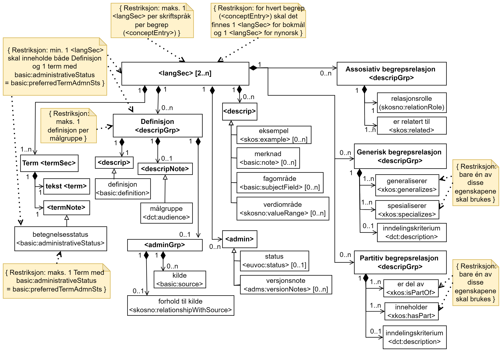

=== <langSec> (1..n) [[langSec]]

[Figur-langSec]
.Begrep (<conceptEntry>) | <langSec> (basert på Fig. 3 i NS-ISO 30042:2019)_
[link=images/TBX-AP-NO_langSec.png]

`<langSec>` er obligatorisk og skal brukes til å representere termer og definisjoner for et gitt begrep i ett gitt skriftspråk. `<langSec>` kan også brukes til å representere valgfri begrepsrelasjoner der det er behov for mer detaljert beskrivelse av relasjonene. De enkelte delene i `<langSec>` er beskrevet i de etterfølgende avsnittene. Språkkoden skal oppgis i start-taggen til `<langSec>` og vil gjelde for hele `<langSec>`, se eksemplet under.

Restriksjon: Det skal være maks. én `<langSec>` per skriftspråk per begrep (<conceptEntry>).

_`<langSec>` is mandatory and shall be used to represent terms and definitions for a given concept in a given language. `<langSec>` may also be used to represent optional concept relations when there is need to describe the relations with details. The various parts of `<langSec>` is described in the following sections. The language code is specified in the start tag of `<langSec>` and will apply to the whole `<langSec>`, see the example below._

_Restriction: There shall be max. one `<langSec>` per language per concept (<conceptEntry>)._

Eksempel i TBX-AP-NO (DCT style), for et fiktivt eksempelbegrep:
[source,xml]
-----
<conceptEntry id="cid-1">
<langSec xml:lang="nb"> <!-- langSec med norsk bokmål -->
   …
</langSec>
</conceptEntry>
-----

=== <langSec> | Term <termSec> (1..n) [[Term]]

`<termSec>` er obligatorisk og skal brukes til å beskrive termer i det gitte språk (`<langSec>`) for det gitte begrepet (`<conceptEntry>`).

Restriksjon: En `<langSec>` kan ha flere `<termSec>` men maks. én der <<Term-betegnelsesstatus>> har verdi `basic:preferredTermAdmnSts`.

_`<termSec>` is mandatory and shall be used to describes terms in that given language (`<langSec>``) for that given concept (``<conceptEntry>`)._

_Resctriction: A `<langSec>` may have several `<termSec>` but max. one where <<Term-betegnelsesstatus>> has value `basic:preferredTermAdmnSts`._

==== <langSec> | Term <termSec> | tekst <term> (1..1) [[Term-tekst]]

[cols="30s,70d"]
|===
| Navn / _Name_   |term / _term_
| Datakategori / _Data category_  |term
| PID |http://datcatinfo.termweb.eu/datcat/DC-508[http://datcatinfo.termweb.eu/datcat/DC-508]
| TBX-nivå / _TBX level_  |termSec
| TBX-klassifisering / _TBX Classification_  |term
| Verdiområde / _Range_  |String
| Anvendelse / _Usage note_ |
Egenskapen brukes til å oppgi selve termen (teksten) i det gitte skriftspråket.

_This property is used to specify the term (the text) in that given language._
| Multiplisitet / _Multiplicity_  |1..1
| Kravnivå / _Requirement level_ |Obligatorisk / _Mandatory_
|===

Eksempel i TBX-AP-NO (DCT style), for NAVs begrep 975 («mødrekvote»):
[source,xml]
-----
<conceptEntry id="BEGREP-975">
   <langSec xml:lang="nb">
      <termSec>
         <term>mødrekvote</term>
      </termSec>
   </langSec>
</conceptEntry>
-----

==== <langSec> | Term <termSec>| <termNote> (1..1) [[termSec-termNote]]

`<termNote>` brukes til å oppgi (obligatorisk) https://www.standard.no/toppvalg/termbasen/Termpost/?TermPostId=35353[betegnelsesstatus] (anbefalt term, tillatt term, frarådd term eller datastrukturterm).

_`<termNote>` is used to specify (mandatory) the https://www.standard.no/toppvalg/termbasen/Termpost/?TermPostId=35353[acceptability rating] of the term (preferred term, admitted term, deprecated term or data structure label)._

===== Term - betegnelsesstatus <basic:administrativeStatus> (1..1) [[Term-betegnelsesstatus]]

[cols="30s,70d"]
|===
| Navn / _Name_   |betegnelsesstatus / _acceptability rating_
| Datakategori / _Data category_  |basic:administrativeStatus
| PID |http://datcatinfo.termweb.eu/datcat/DC-70[http://datcatinfo.termweb.eu/datcat/DC-70]
| TBX-nivå / _TBX level_  |termSec
| TBX-klassifisering / _TBX Classification_  |termNote
| Verdiområde / _Range_  a|Picklist:

* basic:preferredTermAdmnSts
** PID http://datcatinfo.termweb.eu/datcat/DC-72, for anbefalt term / _preferred term_
* basic:admittedTermAdmnSts
** PID http://datcatinfo.termweb.eu/datcat/DC-73, for tillatt term / _admitted term_
* basic:deprecatedTermAdmnSts
** PID http://datcatinfo.termweb.eu/datcat/DC-74, for frarådd term / _deprecated (not recommended) term_
* skosno:dataStructureTerm
** PID https://data.norge.no/vocabulary/skosno#dataStructureTerm, for datastrukturterm / _data structure term_
| Anvendelse / _Usage note_ |
Egenskapen brukes til å oppgi betegnelsesstatus til termen, dvs. om termen er en anbefalt term, tillatt term, frarådd term eller datastrukturterm.

_This property is used to specify the acceptability rating of the term, i.e., if the term is a preferred term, admitted term, deprecated term or data structure term._
| Multiplisitet / _Multiplicity_  |1..1
| Kravnivå / _Requirement level_ |Obligatorisk / _Mandatory_
|===

Eksempel i TBX-AP-NO (DCT style), for NAVs begrep 975 «mødrekvote»:
[source,xml]
-----
<conceptEntry id="BEGREP-975">
   <langSec xml:lang="nb">
      <termSec>
         <term>mødrekvote</term>
         <basic:administrativeStatus>basic:preferredTermAdmnSts</basic:administrativeStatus>
      </termSec>
   </langSec>
</conceptEntry>
-----

=== <langSec> | Definisjon <descripGrp> (0..n)

Denne `<descripGrp>` er anbefalt og bør brukes til å oppgi definisjon til begrepet i det gitte skriftspråket.

Restriksjon 1: Det skal være min. én `<langSec>` som inneholder Definisjon (en slik `<descripGrp>`). Med andre ord: ethvert begrep skal ha minst én definisjon.

Restriksjon 2: Det kan oppgis maks. definisjon (denne `<descripGrp>`) per <<Definisjon-målgruppe>> per skriftspråk (`<langSec>`).

_This `<descripGrp>` is recommended and should be used to specify the definition of the concept in that given language._

_Restriction 1: There shall be min. one `<langSec>` which contains a Definisjon (such a `<descripGrp>`). In other words, every concept shall have min. one definition._

_Restriction 2: There may be max. one definition (this `<descripGrp>`) per <<Definisjon-målgruppe>> per language (`<langSec>`)._

==== <langSec> | Definisjon <descripGrp> (0..n) | tekst <basic:definition> (1..1) [[Definisjon-tekst]]

[cols="30s,70d"]
|===
| Navn / _Name_   |definisjon / _definition_
| Datakategori / _Data category_  |basic:definition
| PID |http://datcatinfo.termweb.eu/datcat/DC-168
| TBX-nivå / _TBX level_  |langSec
| TBX-klassifisering / _TBX Classification_  |descrip
| Verdiområde / _Range_  |String
| Anvendelse / _Usage note_ |
Egenskapen brukes til å oppgi definisjonen i det gitte språket.

_This property is used to specify the definition in the given language._
| Multiplisitet / _Multiplicity_  |1..1
| Kravnivå / _Requirement level_ |Obligatorisk / _Mandatory_
|===

Eksempel i TBX-AP-NO (DCT style), for NAVs begrep 975 («mødrekvote»):
[source,xml]
-----
<conceptEntry id="BEGREP-975">
   <langSec xml:lang="nb">
      <descripGrp>
          <basic:definition>den delen av foreldrepengeperioden som er forbeholdt mor</basic:definition>
      </descripGrp>
   </langSec>
</conceptEntry>
-----

==== <langSec> | Definisjon <descripGrp> (0..n) | målgruppe <dct:audience> (0..1) [[Definisjon-målgruppe]]

[cols="30s,70d"]
|===
| Navn / _Name_   |målgruppe / _audience_
| Datakategori / _Data category_  |dct:audience
| PID |http://purl.org/dc/terms/audience
| TBX-nivå / _TBX level_  |langSec
| TBX-klassifisering / _TBX Classification_  |descripNote
| Verdiområde / _Range_  a|Picklist:

Når begrepsbeskrivelsen gjøres tilgjengelig utenfor virksomheten, og hvis en av kategoriene i det kontrollerte vokabularet https://data.norge.no/vocabulary/audience-type[Målgruppetype] passer til begrepets målgruppe, skal egenskapen referere til den aktuelle kategorien.

_When making the concept description available outside the organization, and if one of the categories in the controlled vocabulary https://data.norge.no/vocabulary/audience-type[Audience type] is suitable for the audience of the concept, this property shall refer to that category._
| Anvendelse / _Usage note_ |
Egenskapen brukes til å oppgi målgruppen for definisjonen, oppgitt som kodet verdi.

_This property is used to specify the audience of the definition, as coded value._
| Multiplisitet / _Multiplicity_  |0..1
| Kravnivå / _Requirement level_ |Valgfri / _Optional_
|===

Eksempel i TBX-AP-NO (DCT style), for et fiktivt eksempel:
[source,xml]
-----
<conceptEntry id="cid-1">
   <langSec xml:lang="nb">
      <descripGrp>
         <basic:definition>begrep som brukes til å eksemplifisere noe med</basic:definition>
         <dct:audience>https://data.norge.no/vocabulary/audience-type#public</dct:audience>
      </descripGrp>
   </langSec>
</conceptEntry>
-----

==== <langSec> | Definisjon <descripGrp> (1..n) | kildebeskrivelse <adminGrp> (0..1) [[Definisjon-kildebeskrivelse]]

Denne `<adminGrp>` er anbefalt og bør brukes til å beskrive kilde(n) til definisjonen.

_This `<adminGrp>` is recommended and should be used to describe the source(s) for the definition._

===== Definisjon – forhold til kilde <skosno:relationshipWithSource> (0..1) [[Definisjon-forhold-til-kilde]]

[cols="30s,70d"]
|===
| Navn / _Name_   |forhold til kilde / _relationship with source_
| Datakategori / _Data category_  |skosno:relationshipWithSource
| PID |https://data.norge.no/vocabulary/skosno#relationshipWithSource
| TBX-nivå / _TBX level_  |langSec
| TBX-klassifisering / _TBX Classification_  |admin
| Verdiområde / _Range_  a|Picklist:

Når begrepsbeskrivelsen gjøres tilgjengelig utenfor virksomheten, og hvis en av kategoriene i det kontrollerte vokabularet https://data.norge.no/vocabulary/relationship-with-source-type[Typer forhold til kilde] passer til begrepets forhold til kilde, skal egenskapen referere til den aktuelle kategorien.

_When making the concept description available outside the organization, and if one of the categories in the controlled vocabulary https://data.norge.no/vocabulary/relationship-with-source-type[Types of relationship with source] is suitable for the concept's relationship with source, this property shall refer to that category._
| Anvendelse / _Usage note_ |
Egenskapen brukes til å oppgi definisjonens forhold til kilde.

_This property is used to specify the definition’s relationship with the source(s)._
| Multiplisitet / _Multiplicity_  |0..1
| Kravnivå / _Requirement level_ |Anbefalt / _Recommended_
| Merknad / _Note_ |
Denne egenskapen skal brukes i en `<adminGrp>` sammen med <<Definisjon-kilde>>.

_This property shall be used in an `<adminGrp>` together with <<Definisjon-kilde>>._
|===

Eksempel i TBX-AP-NO (DCT style), for et fiktivt eksempel:
[source,xml]
-----
<conceptEntry id="cid-1">
   <langSec xml:lang="nb">
      <descripGrp> <!-- descripGrp for a given definition -->
         <basic:definition>…</basic:definition>
         <adminGrp>
            <skosno:relationshipWithSource>https://data.norge.no/vocabulary/relationship-with-source-type#derived-from-source</skosno:relationshipWithSource>
            <basic:source>https://example.org/exampleSource</basic:source>
         </adminGrp>
      </descripGrp>
   </langSec>
</conceptEntry>
-----

===== Definisjon – kilde <basic:source> (0..n) [[Definisjon-kilde]]

[cols="30s,70d"]
|===
| Navn / _Name_   |kilde / _source_
| Datakategori / _Data category_  |basic:source
| PID |http://datcatinfo.termweb.eu/datcat/DC-471
| TBX-nivå / _TBX level_  |langSec
| TBX-klassifisering / _TBX Classification_  |adminNote
| Verdiområde / _Range_  |xref
| Anvendelse / _Usage note_ |
Egenskapen brukes til å oppgi kilde(r) til definisjonen.

_This property is used to specify the source(s) for the definition._
| Multiplisitet / _Multiplicity_  |0..n
| Kravnivå / _Requirement level_ |Anbefalt / _Recommended_
| Merknad / _Note_ |
Denne egenskapen skal brukes i en `<adminGrp>` sammen med <<Definisjon-forhold-til-kilde>>.

_This property shall be used in an `<adminGrp>` together with <<Definisjon-forhold-til-kilde>>._
|===

Eksempel i TBX-AP-NO (DCT style): Se under <<Definisjon-forhold-til-kilde>>.

=== <langSec> | <admin> (0..2) [[langSec-admin]]

`<admin>` her er valgfri og kan brukes til å beskrive begrepets status eller versjonsnoter til begrepets aktuelle versjon.

_`<admin>` here optional and may be used to describe the status of the concept or version note(s) about the current version of the concept._

==== Begrep – status <adms:status> (0..1) [[Begrep-status]]

[cols="30s,70d"]
|===
| Navn / _Name_   |status / _status_
| Datakategori / _Data category_  |adms:status
| PID |http://www.w3.org/ns/adms#status
| TBX-nivå / _TBX level_  |langSec
| TBX-klassifisering / _TBX Classification_  |admin
| Verdiområde / _Range_  |String or Picklist
| Anvendelse / _Usage note_ |
Egenskapen brukes til å oppgi status til begrepet.

_This property is used to specify the status of the concept._
| Multiplisitet / _Multiplicity_  |0..1
| Kravnivå / _Requirement level_ |Valgfri / _Optional_
| Merknad / _Note_ |
Når begrepsbeskrivelsen gjøres tilgjengelig utenfor virksomheten, og hvis en av kategoriene i EUs kontrollerte vokabular https://op.europa.eu/en/web/eu-vocabularies/concept-scheme/-/resource?uri=http://publications.europa.eu/resource/authority/concept-status[Concept status] passer til begrepets status, skal egenskapen referere til den aktuelle kategorien.

_When making the concept description available outside the organization, and if one of the categories in EU’s https://op.europa.eu/en/web/eu-vocabularies/concept-scheme/-/resource?uri=http://publications.europa.eu/resource/authority/concept-status[Concept status] is suitable for the status of the concept, this property shall refer to that category._
|===

Eksempel i TBX-AP-NO (DCT style), for et fiktivt eksempel:
[source,xml]
-----
<conceptEntry id="cid-1">
   <langSec xml:lang="nb">
      <adms:status>http://publications.europa.eu/resource/authority/concept-status/CURRENT</adms:status>
   </langSec>
</conceptEntry>
-----

==== Begrep – versjonsnote <adms:versionNotes> (0..n) [[Begrep-versjonsnote]]

[cols="30s,70d"]
|===
| Navn / _Name_   |versjonsnote / _version notes_
| Datakategori / _Data category_  |adms:versionNotes
| PID |http://www.w3.org/ns/adms#status[http://www.w3.org/ns/adms#status]
| TBX-nivå / _TBX level_  |langSec
| TBX-klassifisering / _TBX Classification_  |admin
| Verdiområde / _Range_  |String
| Anvendelse / _Usage note_ |
Egenskapen brukes til å oppgi versjonsnoter.

_This property is used to specify version notes._
| Multiplisitet / _Multiplicity_  |0..n
| Kravnivå / _Requirement level_ |Valgfri / _Optional_
|===

Eksempel i TBX-AP-NO (DCT style), for SSBs begrep ‘landbakgrunn’:
[source,xml]
-----
<conceptEntry id="landbakgrunn">
   <langSec xml:lang="nb">
      <adms:versionNotes>Fra og med 1.1.2003 ble definisjon endret til også å trekke inn besteforeldrenes fødeland</adms:versionNotes>
   </langSec>
</conceptEntry>
-----

=== <langSec> | <descrip> (0..n) [[langSec-descrip]]

Denne `<descrip>` brukes til å beskrive følgende opplysninger om begrepet: (valgfri) eksempel, (anbefalt) merknad, (anbefalt) fagområde eller (valgfri) verdiområde.

_This `<descrip>` here is used to describe the following information about the concept: (optional) example, (recommended) note, (recommended) subject field or (optional) value range._

==== Begrep – eksempel <skos:example> (0..n) [[Begrep-eksempel]]

[cols="30s,70d"]
|===
| Navn / _Name_   |eksempel / _example_
| Datakategori / _Data category_  |skos:example
| PID |http://www.w3.org/2004/02/skos/core#example
| TBX-nivå / _TBX level_  |langSec
| TBX-klassifisering / _TBX Classification_  |descrip
| Verdiområde / _Range_  |String
| Anvendelse / _Usage note_ |
Egenskapen brukes til å oppgi eksempel på begrepet.

_This property is used to specify examples of the concept._
| Multiplisitet / _Multiplicity_  |0..n
| Kravnivå / _Requirement level_ |Valgfri / _Optional_
|===

Eksempel i TBX-AP-NO (DCT style), for et fiktivt eksempelbegrep:
[source,xml]
-----
<conceptEntry id="cid-1">
   <langSec xml:lang="nb">
      <skos:example>eksempel1, eksempel2, eksempel3</skos:example>
   </langSec>
</conceptEntry>
-----

==== Begrep – merknad <basic:note> (0..n) [[Begrep-merknad]]

[cols="30s,70d"]
|===
| Navn / _Name_   |merknad / _note_
| Datakategori / _Data category_  |basic:note
| PID |http://datcatinfo.termweb.eu/datcat/DC-382
| TBX-nivå / _TBX level_  |langSec
| TBX-klassifisering / _TBX Classification_  |descrip
| Verdiområde / _Range_  |String
| Anvendelse / _Usage note_ |
Egenskapen brukes til å oppgi merknad(er) til begrepet.

_This property is used to specify notes regarding the concept._
| Multiplisitet / _Multiplicity_  |0..n
| Kravnivå / _Requirement level_ |Anbefalt / _Recommended_
|===

Eksempel i TBX-AP-NO (DCT style), for et fiktivt eksempelbegrep:
[source,xml]
-----
<conceptEntry id="cid-1">
   <langSec xml:lang="nb">
      <basic:note>dette er et fiktivt eksempelbegrep som kun skal brukes til eksemplifisering</basic:note>
   </langSec>
</conceptEntry>
-----

==== Begrep – fagområde <basic:subjectField> (0..n) [[Begrep-fagområde]]

[cols="30s,70d"]
|===
| Navn / _Name_   |fagområde / _subject field_
| Datakategori / _Data category_  |basic:subjectField
| PID |http://datcatinfo.termweb.eu/datcat/DC-489
| TBX-nivå / _TBX level_  |langSec
| TBX-klassifisering / _TBX Classification_  |descrip
| Verdiområde / _Range_  |String, ref or xref
| Anvendelse / _Usage note_ |
Egenskapen brukes til å oppgi fagområde(r) til begrepet.

_This property is used to subject field(s) to the concept._
| Multiplisitet / _Multiplicity_  |0..n
| Kravnivå / _Requirement level_ |Anbefalt / _Recommended_
| Merknad / _Note_ | 
Fagområde kan representere en akademisk disiplin, et bruksområde, et produkt, en tjenestekjede eller lignende.

_A subject field may represent an academic discipline, an application area, a produkt, a service chain or suchlike._
|===

Eksempel i TBX-AP-NO (DCT style), for et fiktivt eksempelbegrep:
[source,xml]
-----
<conceptEntry id="cid-1">
   <langSec xml:lang="nb">
      <basic:subjectField>terminologi</basic:subjectField>
   </langSec>
</conceptEntry>
-----

==== Begrep – verdiområde <skosno:valueRange> (0..n) [[Begrep-verdiområde]]

[cols="30s,70d"]
|===
| Navn / _Name_   |verdiområde / _value range_
| Datakategori / _Data category_  |skosno:valueRange
| PID |https://data.norge.no/vocabulary/skosno#valueRange
| TBX-nivå / _TBX level_  |langSec
| TBX-klassifisering / _TBX Classification_  |descrip
| Verdiområde / _Range_  |String or xref
| Anvendelse / _Usage note_ |
Egenskapen brukes til å oppgi verdiområde til begrepet.

_This property is used to specify the value range of the concept._
| Multiplisitet / _Multiplicity_  |0..n
| Kravnivå / _Requirement level_ |Valgfri / _Optional_
|===

Eksempel i TBX-AP-NO (DCT style), for SSBs begrep «sivilstand»:
[source,xml]
-----
<conceptEntry id="sivilstand">
   <langSec xml:lang="nb">
      <skosno:valueRange>Standard for sivilstand</skosno:valueRange>
       <skosno:valueRange>https://www.ssb.no/klass/klassifikasjoner/19</skosno:valueRange>
   </langSec>
</conceptEntry>
-----

=== <langSec> | Assosiativ begrepsrelasjon <descripGrp> (0..n) [[Begrep-har-assosiativ-begrepsrelasjon]]

Denne `<descripGrp>` er valgfri og kan brukes til å beskrive en assosiativ relasjon som det aktuelle begrepet har med andre begreper, når det er behov for å beskrive relasjonen med relasjonsrollen begrepet har.

_This `<descripGrp>` are optional and may be used to describe an associative relation that the current concept has with other concepts, when there is need to describe the relation with the relation role that the concept has._

==== Begrep – er relatert til <skos:related> (1..n) [[Begrep-er-relatert-til-med-relasjonsrolle]]

[cols="30s,70d"]
|===
| Navn / _Name_   |er relater til / _related_
| Datakategori / _Data category_  |skos:related
| PID |http://www.w3.org/2004/02/skos/core#related[http://www.w3.org/2004/02/skos/core#related]
| TBX-nivå / _TBX level_  |langSec
| TBX-klassifisering / _TBX Classification_  |descrip
| Verdiområde / _Range_  |ref or xref
| Anvendelse / _Usage note_ |
Egenskapen brukes til å oppgi et annet begrep som begrepet er relater til.

_This property is used to refer to a concept which this concept is related to._
| Multiplisitet / _Multiplicity_  |1..n
| Kravnivå / _Requirement level_ |Obligatorisk / _Mandatory_
| *Merknad / _Note_ |
Denne egenskapen skal brukes i en `<descripGrp>` sammen med <<Begrep-relasjonsrolle>>.

_This property shall be used in a `<descripGrp>` together with <<Begrep-relasjonsrolle>>._
|===

Eksempel i TBX-AP-NO (DCT style), for et fiktivt eksemeplbegrep:
[source,xml]
-----
<conceptEntry id="cid-1">
   <langSec xml:lang="nb">
      <descripGrp>
         <skos:related>https://example.org/exConcept</skos:related>
         <skosno:relationRole>forutsetter</skosno:relationRole>
       </descripGrp>
   </langSec>
</conceptEntry>
-----

==== Begrep – relasjonsrolle <skosno:relationRole> (1..1) [[Begrep-relasjonsrolle]]

[cols="30s,70d"]
|===
| Navn / _Name_   |relasjonsrolle / _relation role_
| Datakategori / _Data category_  |skosno:relationRole
| PID |https://data.norge.no/vocabulary/skosno#relationRole
| TBX-nivå / _TBX level_  |langSec
| TBX-klassifisering / _TBX Classification_  |descripNote
| Verdiområde / _Range_  |String or picklist
| Anvendelse / _Usage note_ |
Egenskapen brukes til å oppgi relasjonsrollen begrepet har i den aktuelle assosiative relasjonen, enten som kodet verdi eller som tekst.

_This property is used to specify the relation role that the concept has in the associative relation, either as coded value or as text._
| Multiplisitet / _Multiplicity_  |1..1
| Kravnivå / _Requirement level_ |Obligatorisk / _Mandatory_
| Merknad / _Note_ |
Denne egenskapen skal brukes i en `<descripGrp>` sammen med <<Begrep-er-relatert-til-med-relasjonsrolle>>.

_This property shall be used in a <descripGrp> together with er <<Begrep-er-relatert-til-med-relasjonsrolle>>._
|===

Eksempel i TBX-AP-NO (DCT style): Se under <<Begrep-er-relatert-til-med-relasjonsrolle>>.

=== <langSec> | Generisk begrepsrelasjon <descripGrp> (0..n) [[Begrep-har-generisk-begrepsrelasjon]]

Denne `<descripGrp>` er valgfri og kan brukes til å beskrive en generisk relasjon som det aktuelle begrepet har med andre begreper, når det er behov for å beskrive relasjonen med https://termbasen.standard.no/term/165577770503947/nob[inndelingskriterium].

_This `<descripGrp>` is optional and may be used to describe a generic relation that the current concept has with other concepts, when there is need to describe the https://termbasen.standard.no/term/165577770503947/eng[criterion of subdivision]._

==== Begrep – generaliserer <xkos:generalizes> (1..n) [[Begrep-generaliserer-med-inndelingskriterium]]

[cols="30s,70d"]
|===
| Navn / _Name_   |generaliserer / _generalizes_
| Datakategori / _Data category_  |xkos:generalizes
| PID |http://rdf-vocabulary.ddialliance.org/xkos#generalizes[http://rdf-vocabulary.ddialliance.org/xkos#generalizes]
| TBX-nivå / _TBX level_  |langSec
| TBX-klassifisering / _TBX Classification_  |descrip
| Verdiområde / _Range_  |ref or xref
| Anvendelse / _Usage note_ |
Egenskapen brukes til å oppgi et annet begrep som begrepet generaliserer.

_This property is used to refer to a concept which this concept generalizes._
| Multiplisitet / _Multiplicity_  |1..n
| Kravnivå / _Requirement level_ | Obligatorisk / _Mandatory_
| Merknad 1 / _Note 1_ | 
Selv om både denne og egenskapen <<Begrep-spesialiserer-med-inndelingskriterium>> er obligatoriske, skal bare én av disse brukes for en gitt generisk relasjon (`<descripGrp>`).

_Although both this property and the property <<Begrep-spesialiserer-med-inndelingskriterium>> are mandatory, only one of these shall be used for a given generic relation  (`<descripGrp>`)._
| Merknad 2 / _Note 2_ |
Egenskapen/relasjonen kan også leses som «har spesifikt begrep».

_This property/relation may also be read as “has specific concept”._
| Merknad 3 / _Note 3_ |
Egenskapen/relasjonen er den inverse av <<Begrep-spesialiserer-med-inndelingskriterium>>.

_This property/relation is the inverse of <<Begrep-spesialiserer-med-inndelingskriterium>>._
|===

Eksempel i TBX-AP-NO (DCT style), for NAVs begrep 625 («ytelsesperiode») som generaliserer begrep 974 («foreldrepengeperiode»):
[source,xml]
-----
<conceptEntry id="BEGREP-625">
   <langSec xml:lang="nb">
      <descripGrp>
         <xkos:generalizes>https://data.nav.no/begrep/BEGREP-974</xkos:generalizes>
      </descripGrp>
   </langSec>
</conceptEntry>
-----

==== Begrep – spesialiserer <xkos:specializes> (1..n) [[Begrep-spesialiserer-med-inndelingskriterium]]

[cols="30s,70d"]
|===
| Navn / _Name_   |spesialiserer / _specializes_
| Datakategori / _Data category_  |xkos:specializes
| PID |http://rdf-vocabulary.ddialliance.org/xkos#specializes[http://rdf-vocabulary.ddialliance.org/xkos#specializes]
| TBX-nivå / _TBX level_  |langSec
| TBX-klassifisering / _TBX Classification_  |descrip
| Verdiområde / _Range_  |ref or xref
| Anvendelse / _Usage note_ |
Egenskapen brukes til å oppgi et annet begrep som begrepet spesialiserer.

_This property is used to refer to a concept that this concept specializes._
| Multiplisitet / _Multiplicity_  |1..n
| Kravnivå / _Requirement level_ | Obligatorisk / _Mandatory_
| Merknad 1 / _Note 1_ |
Selv om både denne og egenskapen <<Begrep-generaliserer-med-inndelingskriterium>> er obligatoriske, skal bare én av disse brukes for en gitt generisk relasjon (`<descripGrp>`).

_Although both this property and the property <<Begrep-generaliserer-med-inndelingskriterium>> are _Mandatory_, only one of these shall be used for a given generic relation (`<descripGrp>`)._
| Merknad 2 / _Note 2_ |
Egenskapen/relasjonen kan også leses som «har generisk begrep».

_This property/relation may also be read as “has generic concept”._
| Merknad 3 / _Note 3_ |
Egenskapen/relasjonen er den inverse av <<Begrep-generaliserer-med-inndelingskriterium>>.

_This property/relation is the inverse of <<Begrep-generaliserer-med-inndelingskriterium>>._
|===

Eksempel i TBX-AP-NO (DCT style), for NAVs begrep 974 («foreldrepengeperiode») som spesialiserer begrep 625 («ytelsesperiode»):
[source,xml]
-----
<conceptEntry id="BEGREP-974">
   <langSec xml:lang="nb">
      <descripGrp>
         <xkos:specializes>https://data.nav.no/begrep/BEGREP-625</xkos:specializes>
      </descripGrp>
   </langSec>
</conceptEntry>
-----

==== Begrep – generisk begrepsrelasjon – inndelingskriterium <dct:description> (0..1) [[Begrep-generisk-begrepsrelasjon-inndelingskriterium]]

[cols="30s,70d"]
|===
| Navn / _Name_   |inndelingskriterium / _criterion of subdivision_
| Datakategori / _Data category_  |dct:description
| PID |http://purl.org/dc/terms/description
| TBX-nivå / _TBX level_  |langSec
| TBX-klassifisering / _TBX Classification_  |descripNote
| Verdiområde / _Range_  |String or xref
| Anvendelse / _Usage note_ |
Egenskapen brukes til å oppgi inndelingskriterium for begrepsrelasjonen.

_This property is used to specify the criterion of subdivision for the concept relation._
| Multiplisitet / _Multiplicity_  |0..1
| Kravnivå / _Requirement level_ |Anbefalt / _Recommended_
|===

Eksempel i TBX-AP-NO (DCT style), for et fiktivt eksempelbegrep:
[source,xml]
-----
<conceptEntry id="cid-1">
   <langSec xml:lang="nb">
      <descripGrp>
         <xkos:specializes>https://example.org/exConcept2</xkos:specializes>
         <dct:description>anatomi</dct:description>
      </descripGrp>
   </langSec>
</conceptEntry>
-----

=== <langSec> | Partitiv begrepsrelasjon <descripGrp> (0..n) [[Begrep-har-partitiv-begrepsrelasjon]]

Denne `<descripGrp>` er valgfri og kan brukes til å beskrive en partitiv relasjon som det aktuelle begrepet har med andre begreper, når det er behov for å beskrive  https://termbasen.standard.no/term/165577770503947/nob[inndelingskriterium].

_This `<descripGrp>` is optional and may be used to describe a partitive relation that the concept has with other concepts, when there is need to describe https://termbasen.standard.no/term/165577770503947/eng[criterion of subdivision]._

==== Begrep – er del av <xkos:isPartOf> (1..n) [[Begrep-er-del-av-med-inndelingskriterium]]

[cols="30s,70d"]
|===
| Navn / _Name_   |er en del av / _is part of_
| Datakategori / _Data category_  |xkos:isPartOf
| PID |http://rdf-vocabulary.ddialliance.org/xkos#isPartOf[http://rdf-vocabulary.ddialliance.org/xkos#isPartOf]
| TBX-nivå / _TBX level_  |langSec
| TBX-klassifisering / _TBX Classification_  |descrip
| Verdiområde / _Range_  |ref or xref
| Anvendelse / _Usage note_ |
Egenskapen brukes til å oppgi et annet begrep som begrepet er del av.

_This property is used to refer to a concept which this concept is part of._
| Multiplisitet / _Multiplicity_  |1..n
| Kravnivå / _Requirement level_ | Obligatorisk / _Mandatory_
| Merknad 1 / _Note 1_ |
Selv om både denne og egenskapen <<Begrep-inneholder-med-inndelingskriterium>> er obligatoriske, skal bare én av disse brukes for en gitt partitiv relasjon  (`<descripGrp>`).

_Although both this property and the property <<Begrep-inneholder-med-inndelingskriterium>> are mandatory, only one of these shall be used for a given partitive relation  (`<descripGrp>`)._
| Merknad 2 / _Note 2_ |
Egenskapen/relasjonen kan også leses som «har helhetsbegrep».

_This property/relation may also be read as “has comprehensive concept”._
| Merknad 3 / _Note 3_ |
Egenskapen/relasjonen er den inverse av <<Begrep-inneholder-med-inndelingskriterium>>.

_This property/relation is the inverse of <<Begrep-inneholder-med-inndelingskriterium>>._
|===

Eksempel i TBX-AP-NO (DCT style), for NAVs begrep 975 («mødrekvote») som er del av begrep 974(«foreldrepengeperiode»):
[source,xml]
-----
<conceptEntry id="BEGREP-975">
   <langSec xml:lang="nb">
      <descripGrp>
         <xkos:isPartOf>https://data.nav.no/begrep/BEGREP-974</xkos:isPartOf>
      </descripGrp>
   </langSec>
</conceptEntry>
-----

==== Begrep – inneholder <xkos:hasPart> (1..n) [[Begrep-inneholder-med-inndelingskriterium]]

[cols="30s,70d"]
|===
| Navn / _Name_   |inneholder / _has part_
| Datakategori / _Data category_  |xkos:hasPart
| PID |http://rdf-vocabulary.ddialliance.org/xkos#hasPart[http://rdf-vocabulary.ddialliance.org/xkos#hasPart]
| TBX-nivå / _TBX level_  |langSec
| TBX-klassifisering / _TBX Classification_  |descrip
| Verdiområde / _Range_  |ref or xref
| Anvendelse / _Usage note_ |
Egenskapen brukes til å oppgi et annet begrep som begrepet inneholder (består av).

_This property is used to refer to a concept which this concept has as part._
| Multiplisitet / _Multiplicity_  |1..n
| Kravnivå / _Requirement level_ | Obligatorisk / _Mandatory_
| Merknad 1 / _Note 1_ |
Selv om både denne og egenskapen <<Begrep-er-del-av-med-inndelingskriterium>> er obligatoriske, skal bare én av disse brukes for en gitt partitiv relasjon (`<descripGrp>`).

_Although both this property and the property <<Begrep-er-del-av-med-inndelingskriterium>> are mandatory, only one of these shall be used for a given partitive relation (`<descripGrp>`)._
| Merknad 2 / _Note 2_ |
Egenskapen/relasjonen kan også leses som «har delbegrep».

_This property/relation may also be read as “has partitive concept”._
| Merknad 3 / _Note 3_ |
Egenskapen/relasjonen er den inverse av <<Begrep-er-del-av-med-inndelingskriterium>>.

_This property/relation is the inverse of <<Begrep-er-del-av-med-inndelingskriterium>>._
|===

Eksempel i TBX-AP-NO (DCT style), for NAVs begrep 974 («foreldrepengeperiode») som inneholder begrep 975 («mødrekvote»), begrep 976 («fellesperiode») og begrep 1467 («fedrekvote»):
[source,xml]
-----
<conceptEntry id="BEGREP-974">
   <langSec xml:lang="nb">
      <descripGrp>
         <xkos:hasPart>https://data.nav.no/begrep/BEGREP-975</xkos:hasPart>
         <xkos:hasPart>https://data.nav.no/begrep/BEGREP-976</xkos:hasPart>
         <xkos:hasPart>https://data.nav.no/begrep/BEGREP-1467</xkos:hasPart>
      </descripGrp>
   </langSec>
</conceptEntry>
-----

==== Begrep – partitiv begrepsrelasjon – inndelingskriterium <dct:description> (0..1) [[Begrep-partitiv-begrepsrelasjon-inndelingskriterium]]

[cols="30s,70d"]
|===
| Navn / _Name_   |inndelingskriterium / _criterion of subdivision_
| Datakategori / _Data category_  |dct:description
| PID |http://purl.org/dc/terms/description[http://purl.org/dc/terms/description]
| TBX-nivå / _TBX level_  |langSec
| TBX-klassifisering / _TBX Classification_  |descripNote
| Verdiområde / _Range_  |String or xref
| Anvendelse / _Usage note_ |
Egenskapen brukes til å oppgi inndelingskriterium for  begrepsrelasjonen.

_This property is used to specify the criterion of subdivision for the concept relation._
| Multiplisitet / _Multiplicity_  |0..1
| Kravnivå / _Requirement level_ |Anbefalt / _Recommended_
|===

Eksempel i TBX-AP-NO (DCT style), for et fiktivt eksempelbegrep:
[source,xml]
-----
<conceptEntry id="cid-1">
   <langSec xml:lang="nb">
      <descripGrp>
         <xkos:hasPart>https://example.org/exConcept</xkos:hasPart>
         <dct:description>anatomi</dct:description>
      </descripGrp>
   </langSec>
</conceptEntry>
-----
